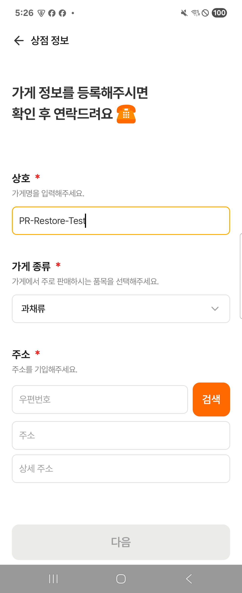
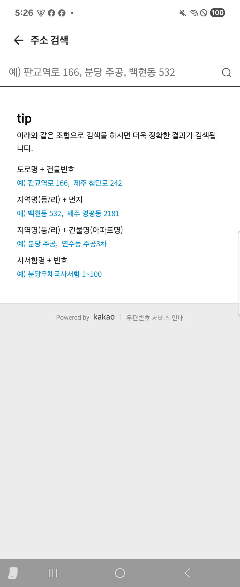
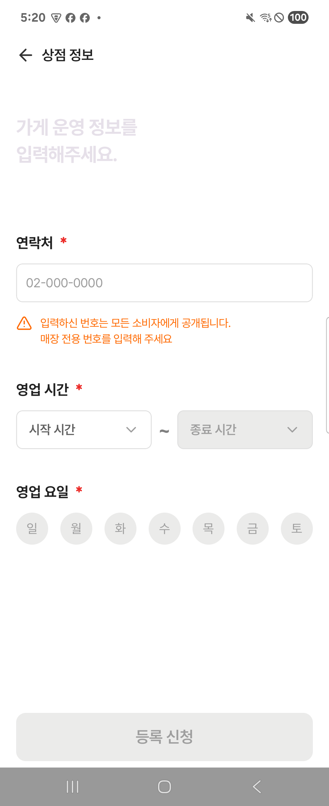
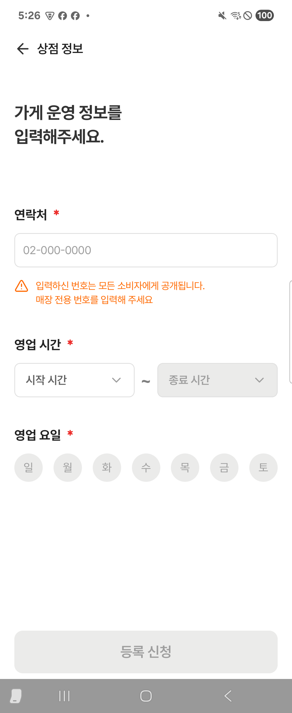
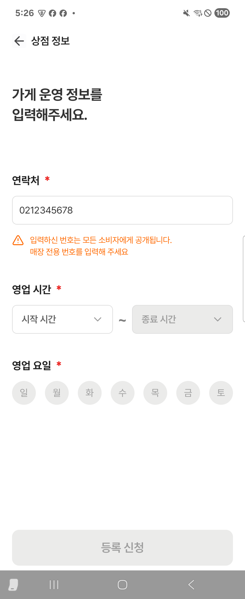

# 점주 온보딩 PR 검증 — 2026-09-13

## 검증 대상과 결론

- 브랜치: `feat/owner-onboarding`, 검증한 코드 HEAD: `3d3e0a4`.
- 비교 기준: 로컬 `origin/develop` (`60a4315`) 대비 전체 온보딩 변경과 현재 작업 트리.
- 마지막 코드 변경: 운영 화면 제목에 `textTitle` 색상을 명시한 1줄. 해당 변경 이후 Owner Debug/Release 빌드·lint·온보딩 테스트를 재실행했다.
- 실행한 빌드·정적 검사·테스트에는 실패가 없다. 등록 API 연동 완료를 의미하지 않으며, 아래 미연결 범위를 PR에 명시해야 한다.

## 결과

| 검증 | 결과 |
|---|---|
| staged/unstaged `git diff --check` | 통과 |
| 전체 `ktlintCheck` | 통과 |
| Consumer Debug/Release APK 조립·lint | 통과 |
| Owner Debug/Release APK 조립·lint | 통과 |
| 온보딩 단위 테스트 | 13개 통과 |
| Consumer/Owner 앱 단위 테스트 | 각 1개 통과 |
| 온보딩 Android 테스트 | 17개 통과, 건너뜀 없음 |
| Consumer/Owner 앱 Android 테스트 | 각 1개 통과, 각 2개 건너뜀 |
| `core:utils:testDebugUnitTest` | NO-SOURCE: 실행할 테스트 없음 |
| 실제 카카오 검색·선택·화면 이동 | 통과 |
| 실제 프로세스 종료 후 운영 화면·연락처 복원 | 통과 |

기기: Samsung SM-F711N, Android 15 (`R5CRC2VSQMJ`). 앱 Android 테스트의 건너뜀은 초기 네트워크 기대값 인자 미제공 1개와 에뮬레이터 전용 네트워크 전환 검사 1개이며, 각 Flavor에서 동일하다.

Lint 오류는 0개다. 경고는 Owner Release 20개, 나머지 변형 각 21개로 버전 업데이트 안내, 런처 VectorPath, 미사용 리소스 등이다. Consumer Release D8의 Naver Maps SDK stack-map 경고도 있었으나 빌드는 성공했다. 환경 진단은 실패 0개, 시스템 Java 20과 문서 기준 17 차이 경고 1개였다.

## 확인한 동작

- 고정 카테고리 6개를 초기화 이벤트 없이 선택할 수 있으며 잘못된 선택은 거부한다.
- Navigation에서 ViewModel을 생성하지 않고 각 Route의 `hiltViewModel()`을 사용한다.
- 기본 정보를 Serializable 객체로 Bundle 인자에 전달하고 운영 ViewModel이 자신의 SavedStateHandle에서 읽는다.
- 주소 결과를 Route에서 반영하고 소비하여 중복 적용을 방지한다.
- 시간 드롭다운은 24시간제, 1시간 간격이다. 종료 시간은 시작 이상이며 시작 변경으로 무효화된 종료는 초기화된다.
- 미연결 등록 요청은 입력을 유지하면서 오류를 표시하고 성공으로 처리하지 않는다.
- 저장 상태 Parcel 왕복, 화면별 ViewModel 수명, 뒤로가기 후 최신 기본 정보 재전달을 검사했다.
- 복원된 성공 안내의 확인 버튼은 한 번만 완료 이벤트를 전달한다.
- 작은 화면·큰 글씨에서 기본 정보 입력 필드에 접근할 수 있다.

실제 서비스 검증에서는 `03965`를 검색하고 `서울 마포구 성미산로1길 92`를 선택했다. 주소가 기본 화면에 반영되고 운영 화면에 진입했다. 연락처 입력 후 Home으로 이동해 프로세스를 종료했고, PID `14934`가 사라진 것을 확인한 뒤 동일한 런처 Intent로 재실행했다. 새 PID `16097`에서 운영 화면과 `0212345678`이 복원됐다. 앞선 수동 시도는 동일한 런처 조건과 종료 여부가 확인되지 않아 복원 증거로 사용하지 않았다.

## 검증 과정에서 수정한 항목

- 계측 테스트의 들여쓰기 오류.
- 스테이징에만 남은 삭제된 빈 파일 3개.
- 성공 안내 확인 버튼의 반대 활성 조건과 잘못된 액션 연결. 회귀 테스트 추가.
- 앱 패키지 테스트의 Flavor 미반영 비교. BuildConfig 생성이 없어 테스트 패키지명에서 대상 패키지명을 비교하도록 수정.
- 운영 제목의 낮은 대비: 기본 화면과 동일한 제목 색상 적용.
- 실제 코드와 불일치하던 README의 그래프 범위·샘플 등록·타임아웃 설명.

## 실행 명령

표준 verify.sh는 Flavor 도입 전의 모호한 태스크명을 사용하므로 현재 Flavor를 명시한 동등 검증을 실행했다.

```sh
./scripts/agent/doctor.sh
git diff --check
git diff --cached --check
./gradlew ktlintCheck :feature:owner:onboarding:testDebugUnitTest :core:utils:testDebugUnitTest :app:testConsumerDebugUnitTest :app:testOwnerDebugUnitTest :app:lintConsumerDebug :app:lintOwnerDebug :app:lintOwnerRelease :app:assembleConsumerDebug :app:assembleOwnerDebug :app:assembleOwnerRelease --console=plain
./gradlew ktlintCheck :app:assembleConsumerRelease :app:lintConsumerRelease :app:lintConsumerDebug :app:lintOwnerDebug :feature:owner:onboarding:connectedDebugAndroidTest :app:connectedConsumerDebugAndroidTest :app:connectedOwnerDebugAndroidTest --no-parallel --console=plain
# 마지막 제목 색상 수정 이후 재검증
./gradlew :feature:owner:onboarding:ktlintCheck :feature:owner:onboarding:testDebugUnitTest :app:lintOwnerDebug :app:lintOwnerRelease :app:assembleOwnerDebug :app:assembleOwnerRelease :feature:owner:onboarding:connectedDebugAndroidTest --console=plain
```

로컬 로그: `/tmp/mangro-pr-verification.log`, `/tmp/mangro-pr-device-final.log`, `/tmp/mangro-pr-owner-final.log`, `/tmp/mangro-pr-manual.log`. 실제 UI 검증 스크립트와 XML 증거는 `/tmp/mangro-pr-manual.py`, `/tmp/mangro-pr-evidence/`에 있다.

## 미연결·미검증 범위

- 매장 등록 Repository/API, 실제 접수 성공과 서버 중복 요청 방지는 미연결이다. Submitter와 샘플 성공 DI는 제거했다.
- 카테고리 메뉴는 고정이나 `debug-*` ID는 서버 코드가 아니다.
- Owner Release APK는 빌드했지만 운영 진입 화면은 기존 화면이며, 온보딩 런타임 검증은 Owner Debug로 수행했다.
- 실기기에서 네트워크 전환·재시도 전체 흐름, 오래된 WebView, 다른 OS/기기, IME 애니메이션 프레임 분석은 미실행이다.
- WebView 로딩에 별도 타임아웃은 없다. 실제 CDN 로딩과 검색은 확인했지만 원격 iframe이 무응답인 경우까지 확인하지 않았다.
- Figma와 픽셀 단위 일치 검증은 수행하지 않았다.
- Release APK 조립은 서명된 배포 또는 스토어 제출 검증이 아니다.

## 화면 증거

아래 이미지는 실제 기기에서 캡처했다. 캡처 스트림 앞의 기기 다중 디스플레이 경고 문구만 분리했으며 픽셀은 수정하지 않았다.

### 기본 정보와 주소 검색




### 운영 제목 수정 전후




### 프로세스 종료 후 복원


