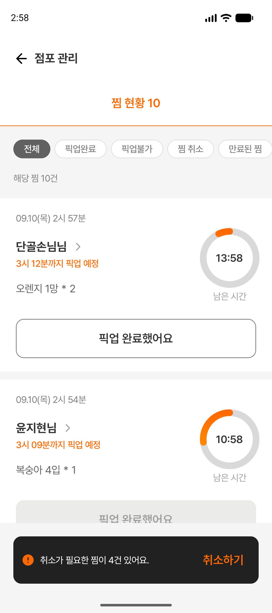
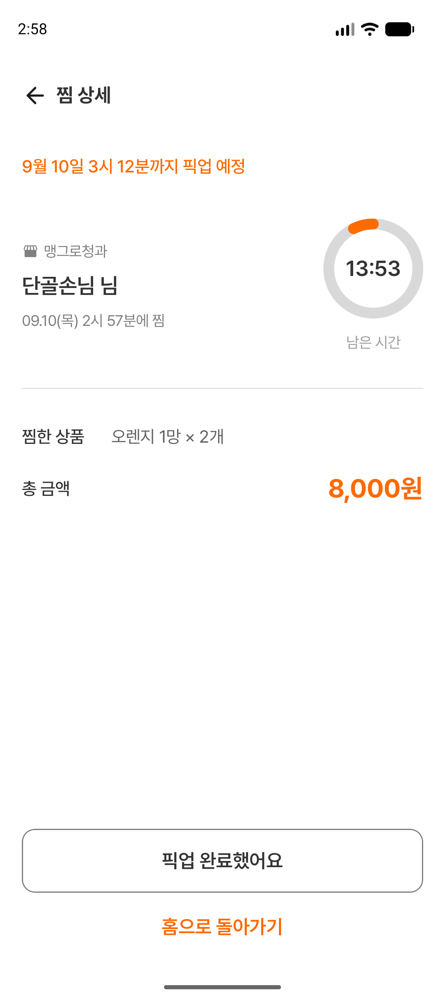
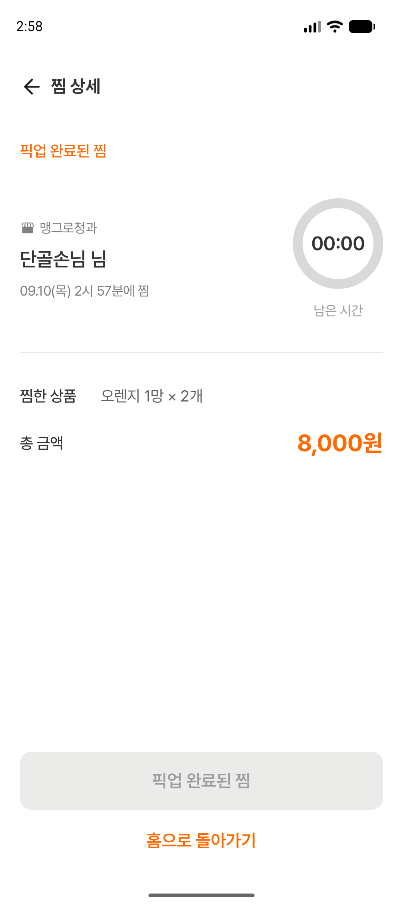
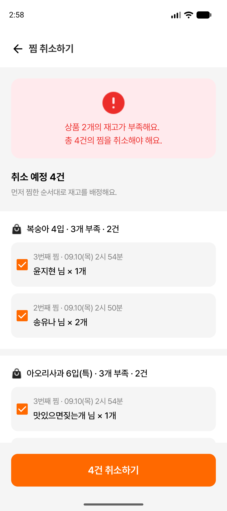
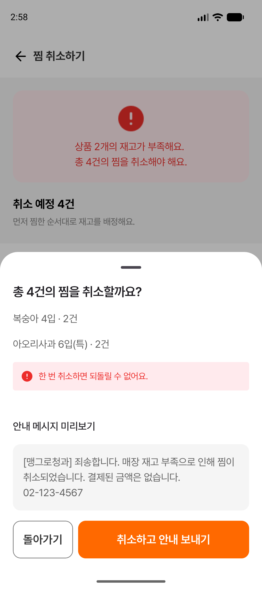
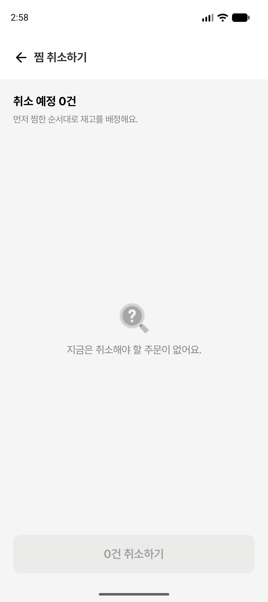
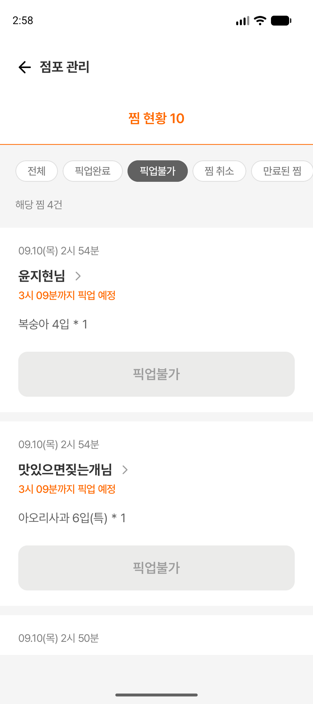

# #66 점주 찜 현황·픽업 처리 검증

- 기준: `origin/develop` (`a4d5664`)
- 브랜치: `feat/owner-pickup`
- worktree: `/private/tmp/mangro-owner-pickup`
- 구현 범위·Figma 노드·서버 연동 계약: [모듈 안내](../../feature/owner/pickup/README.md)

## 변경

`:feature:owner:pickup` 모듈에 상태별 목록, 상세, 선착순 재고 배정과 취소 대상 선택, 확인 바텀시트 및 안내 미리보기를 구현했다. 공통 찜 카드에 픽업불가/취소 상태와 독립적인 완료 버튼 비활성화 옵션을 추가했다. Owner 소스셋에 진입점을 연결하고 전용 테마를 적용했다. Debug 샘플과 Release 빈 화면을 소스셋으로 분리했다.

## 빌드·정적 검사

다음 태스크 성공:

```sh
./gradlew ktlintCheck \
  :feature:owner:pickup:testDebugUnitTest \
  :app:testOwnerDebugUnitTest :app:testConsumerDebugUnitTest \
  :app:assembleOwnerDebug :app:assembleConsumerDebug \
  :app:assembleOwnerRelease \
  :app:lintOwnerDebug :app:lintConsumerDebug
```

- 신규 도메인 단위 테스트 13개 성공: 선착순·동률 배정, 부분 부족, 상품별 재고, 충분/미조회 재고, 만료 경계, 상태 필터, 중복 처리 방지, 취소 후 재배정, 총액, 잘못된 입력.
- 앱 단위 테스트: Owner/Consumer 각 1개 성공(기존 예제 테스트).
- Lint: 오류 0개. Owner 경고 17개, Consumer 경고 18개(의존성 업데이트 알림 등).
- Owner Release는 샘플 고객과 로컬 처리 구현이 포함되지 않는 소스셋으로 빌드했다.
- `git diff --check` 성공.

초기 검증에서 테마 토큰 이름, BuildConfig 미생성, 상수 작명 및 테스트 import 오류가 발견되어 수정했다. 최종 빌드에는 해당 오류가 없다.

## 기기 검증

Pixel_10 API 37, `emulator-5554`, 화면 켜짐·잠금 해제 상태에서 실행:

```sh
./gradlew :app:connectedOwnerDebugAndroidTest \
  -Pandroid.testInstrumentationRunnerArguments.class=com.swyp.mangro.OwnerPickupFlowTest
```

계측 테스트 5개 성공:

1. 상세 총액 → 픽업 완료 → 완료 필터 → 홈 복귀 및 상세 선택 해제.
2. 취소 대상 선택 해제/재선택 → 안내 미리보기 → 돌아가기 → 재확인/실행 → 0건 빈 상태.
3. 처리 실패 시 확인 화면 유지와 재시도.
4. 처리 중 추가 실행 및 홈 이동 비활성화.
5. 만료 상세 버튼 비활성화 및 빈 필터.

테마·앱바·타이머를 실제 화면에서 보정한 후 Owner 빌드·Lint·5개 계측 테스트를 다시 실행했다. 홈 복귀 후 상세가 복원되는 문제도 수정하고 회귀 확인에 포함했다.

## 화면 증거

검증한 APK를 설치·실행해 Debug 샘플에서 촬영했다. UI 트리의 실제 텍스트와 터치 위치로 조작했다. 재고 부족 4건, 2개 수량의 총액 8,000원, 픽업 완료 후 00:00 및 홈 재진입, 취소 결과의 빈 상태와 픽업불가 필터를 확인했다.

| 목록 | 상세 |
|---|---|
|  |  |

| 픽업 완료 | 취소 대상 |
|---|---|
|  |  |

| 취소 확인 | 취소 후 0건 |
|---|---|
|  |  |



## 미실행·후속 연결

- 실제 API 연동, 서버 재고 동시성, 실제 안내 메시지 전송, 데이터 영속화: API 구현이 없어 미실행. Debug 콜백은 로컬 상태만 변경한다. Release는 빈 화면이다.
- 기존 전체 계측 테스트 및 Consumer 기기 테스트: 미실행. 이번 변경의 Owner 전용 테스트를 선택 실행했다. 기존 `ExampleInstrumentedTest`의 공통 applicationId 단정은 Flavor와 맞지 않아 별도 수정이 필요하다.
- 실제 단말, 대형 글꼴, 화면 회전·프로세스 재생성, Consumer Release: 미실행.
- 기존 점주 홈/상품 모듈은 develop에 없어 합치지 않았다. 통합 시 이 기능의 앱 진입점을 해당 내비게이션에 연결해야 한다.
- 공통 CircularProgress의 기존 색상·형태를 재사용하여 Figma의 완료 상태 링 색상과 차이가 있다.
